# Curso de programación estocástica y dinámica

**TABLE OF CONTENT**

---

# Objetivos

-   Aprender cuándo utilizar Programación Dinámica y sus beneficios.
-   Entender la diferencia entre programas deterministas y estocásticos.
-   Aprender a utilizar la Programación estocástica.
-   Aprender a crear simulaciones computacionales válidas.

# **Programación Dinámica**

### Introducción a la Programación Dinámica

En la década de los 50s Richard Bellman necesitaba financiamiento del gobierno para poder continuar con sus investigaciones, por lo que necesitaba un nombre rimbombante para que no fueran capaz de rechazar su solicitud, por lo que eligió programación dinámica. Las propias palabras de Bellman fueron

_"[El nombre] Programación Dinámica se escogió para esconder a patrocinadores gubernamentales el hecho que en realidad estaba haciendo Matemáticas. La frase Programación Dinámica es algo que ningún congresista puede oponerse." - Richard Bellman._

Entonces sabiendo que **Programación Dinámica** no esta relacionada con su nombre, lo cierto es que si es una de las técnicas mas poderosas para poder optimizar cierto tipo de problemas.

Los problemas que puede optimizar son aquellos que tienen una **subestructura óptima**, esto significa que una **solución óptima global** se puede encontrar al combinar soluciones óptimas de subproblemas locales.

También nos podemos encontrar con los **problemas empalmados**, los cuales implican resolver el mismo problema en varias ocasiones para dar con una solución óptima.

Una técnica para obtener una alta velocidad en nuestro programa es la **Memorización**, el cual consiste en guardar cómputos previos y evitar realizarlos nuevamente. Normalmente se utiliza un diccionario, donde las consultas se pueden hacer en `O(1)`, y para ello hacemos un cambio de *tiempo por espacio.*

### Optimización de Fibonacci

La serie de _Fibonacci_ se representa como Fn = Fn-1 + Fn-2 y es muy simple implementarla de forma recursiva en código. Sin embargo, es muy ineficiente hacerlo simplemente recursivo, ya que repetimos varias veces cómputos idénticos. Esto se puede ver en la imagen:

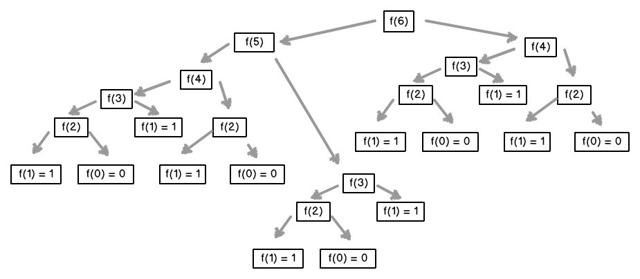

Para **optimizar** la forma recursiva del algoritmo de _Fibonacci_ podemos usar el dict memo para que el algoritmo vaya guardando en el los calculos que va realizando y asi no tener que repetirlos:

```python
def fibonacci_dinamico(n, memo = {}):
    if n == 0 or n == 1:
        return 1

    try:
        return memo[n]

    except KeyError:
        resultado = fibonacci_dinamico(n - 1, memo) + fibonacci_dinamico(n - 2, memo)
        memo[n] = resultado

        return resultado
```

# Caminos aleatorios

### ¿Qué son los caminos aleatorios?

Son un tipo de simulación que elige aleatoriamente una decisión dentro de un conjunto de estas. Se utilizan en muchos campos del conocimiento y constituyen sistemas no deterministas, es decir sistemas que incluyen elemento de aleatoriedad.

### Camino del borracho

Consiste en la implementación de objetos para modelar un campo coordenado donde un borracho camina aleatoriamente en diferentes direcciones. El movimiento del borracho consiste en elegir aleatoriamente si se mueve para x positivo, y positivo, x negativo o y negativo en cada paso que da. Ej:

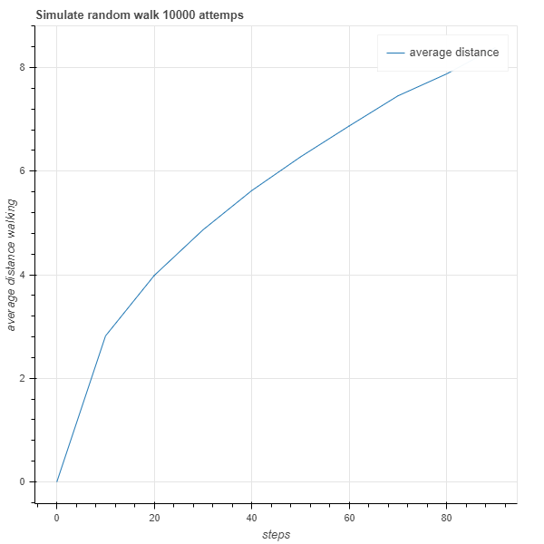

Se puede ver cómo a medida que el borracho aumenta la cantidad de pasos por caminata, aunque estos son aleatorios la distancia media por caminata tienen a aumentar si se hacen más simulaciones.

En la siguiente imagen se puede ver uno de los caminos aleatorios

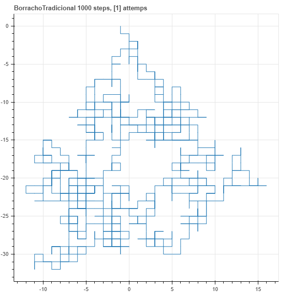

# Programas Estocásticos

### Introducción a la Programación Estocástica

Un programa es **determinístico** cuando se corre con un mismo *input* produce el mismo *output*. Los programas **determinísticos** son muy importantes, pero existen problemas que no pueden resolverse de esa manera.

La **programación estocástica** permite introducir aleatoriedad a nuestros programas para crear simulaciones que permiten resolver otro tipo de problemas. Los **programas estocásticos** se aprovechan de que las **distribuciones probabilísticas** de un problema se conocen o pueden ser estimadas.

### Cálculo de Probabilidades

La **probabilidad** es una medida de la certidumbre asociada a un evento o suceso futuro y suele expresarse como un número entre 0 y 1.

Al hablar de **probabilidad** preguntamos qué fracción de todos los posibles eventos tiene la propiedad que buscamos, por eso es importante poder calcular todas las posibilidades de un evento para entender su probabilidad. La probabilidad de que un evento suceda más la probabilidad de el que el mismo evento no suceda siempre es 1.

-   Ley del complemento:
    -   P(A) + P(~A) = 1
-   Ley multiplicativa:
    -   P(A y B) = P(A) \* P(B)
-   Ley aditiva:
    -   Mutuamente exclusivos: P(A o B) = P(A) + P(B)
    -   No exclusivos: P(A o B) = P(A) + P(B) - P(A y B)

### Inferencia estadística

Las técnicas de la **inferencia estadística** nos permiten inferir/concluir las propiedades de una población a partir de una muestra aleatoria.

_"El principio guía de la **inferencia estadística** es que una muestra aleatoria tiende a exhibir las mismas propiedades que la población de la cual fue extraída" - John Guttag_

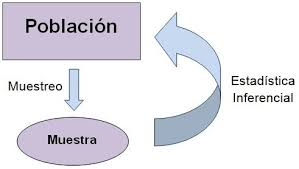

### Ley de los grandes números

Podemos observar con **la ley de los grandes números** que en pruebas independientes repetidas con la misma probabilidad _P_ de un resultado, la fracción de desviaciones de _P_ converge a cero conforme la cantidad de pruebas se acerca al infinito.

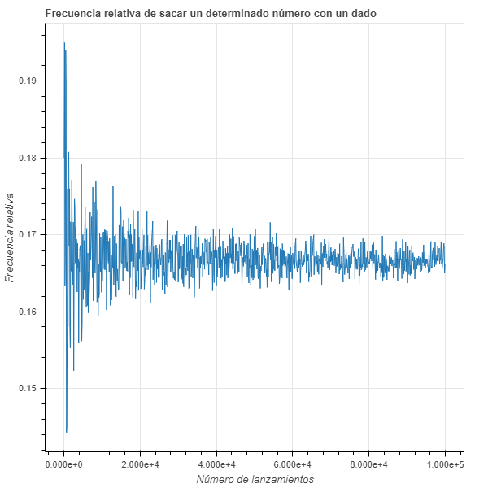

Como se puede ver a mayor número de simulaciones la probabilidad se va acercando a 0,166666

### Falacia del apostador

La **falacia del apostador** señala que después de un evento extremo, ocurrirán eventos menos extremos para nivelar la media. Es una falsa creencia, lo que realmente ocurre es la regresión a la media:

La **_regresión a la media_** señala que después de un evento aleatorio extremo, el siguiente evento será menos extremo.

### Media

La **media** es una medida de tendencia central, comúnmente conocido como promedio. La media de una población se denota con el símbolo μ y la media de una muestra se define con X̄.

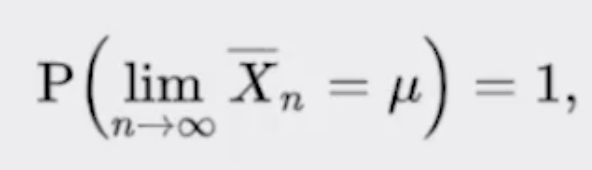

Calcular la media de un conjunto de números en python:

```python
def media(X):

    return sum(X) / len(X)
```

Se puede ver el concepto de la **ley de los grandes números:**

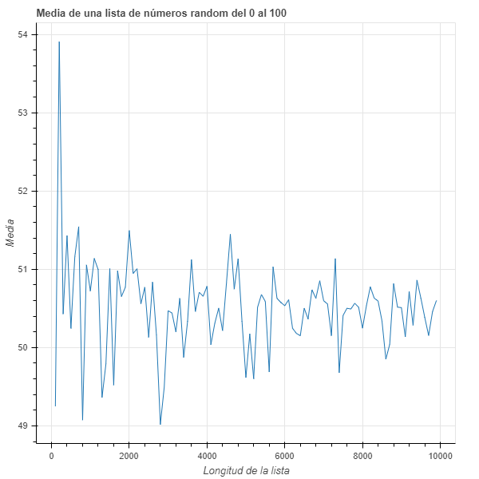

### Varianza y Desviación Estándar

La **varianza** mide qué tan propagados se encuentran un conjunto de valores aleatorios de su media. Mientras que la media nos da una idea de donde se encuentran los valores, **la varianza** nos dice que tan dispersos se encuentran. La varianza siempre debe entenderse con respecto a la media.

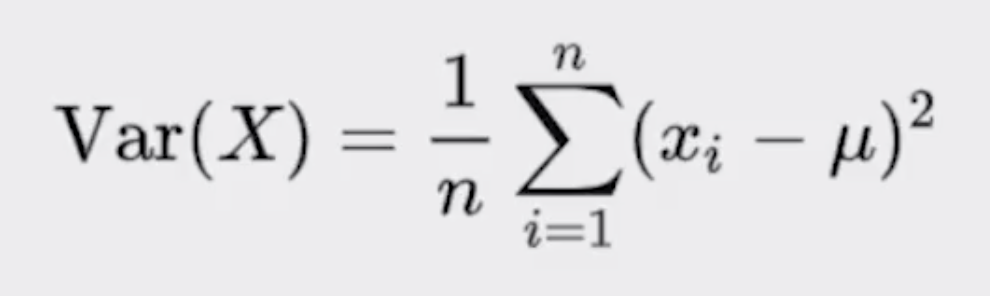

La **desviación estándar** es la raíz cuadrada de la varianza, o en otras palabras, sigma (σ) es la raíz cuadrada del valor promedio de (X - μ)2. Nos permite entender, también, la propagación y se debe entender siempre relacionado con la media.

La desviación estándar está en las mismas unidades que la media.

En código vemos la implementación de las funciones **varianza** y **desviación estándar**.

```python
def varianza(X):

    mu = media(X)

    acumulador = 0

    for x in X:
        acumulador += (x - mu)**2

    return acumulador / len(X)

def desviacion_estandar(X):

    return (varianza(X)**0.5)
```

### Distribución normal

En una de las distribuciones más recurrentes en cualquier ámbito. Se define completamente por su media y su desviación estándar. Permite calcular intervalos de confianza con la **regla empírica**.

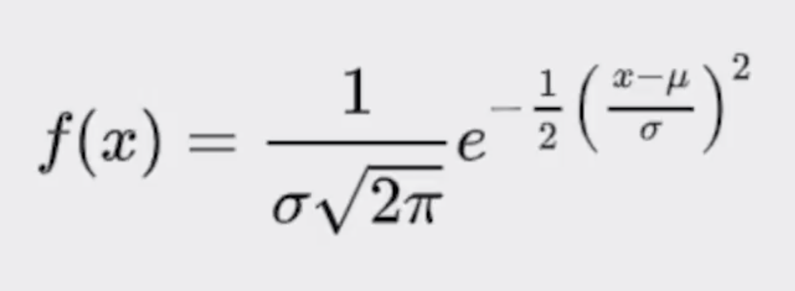

### Regla empírica

También conocida como la regla 68-95-99,7. Señala cuál es la dispersión de los datos en una distribución normal a uno, dos y tres sigmas.

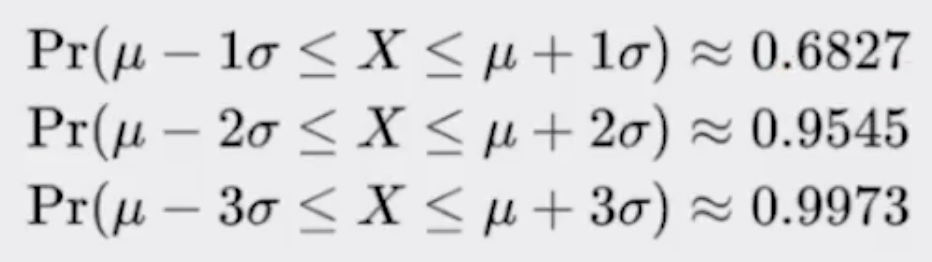

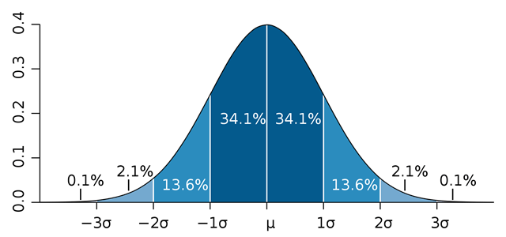

# Simulaciones de Montecarlo

### ¿Qué son las Simulaciones de Montecarlo?

Son simulaciones que permiten predecir el resultado de un problema y convertir problemas determinísticos en problemas estocásticos.

### Simulación de Barajas

En el código, en el path del curso, calculamos la probabilidad de obtener un par en diferentes tamaños de mano:

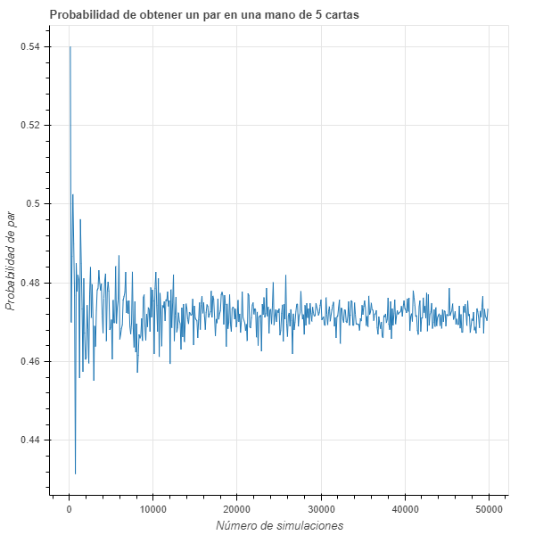

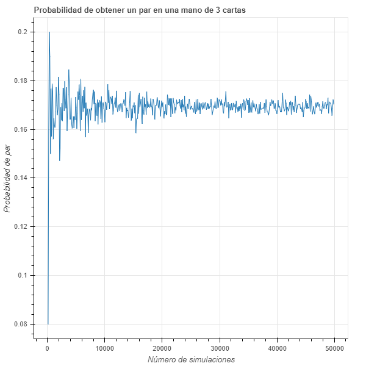

### Cálculo de Pi

En código calculamos el valor de Pi mediante el método de puntos al azar en un plano cartesiano. Utilizamos las funciones de media y desviación estándar para ajustar el algoritmo y ganar precisión

Los resultados son los siguientes:

```python
Media (pi): 3.14159 Sigma: 0.04968 Puntos: 1000
Media (pi): 3.14164 Sigma: 0.03723 Puntos: 2000
Media (pi): 3.14045 Sigma: 0.02634 Puntos: 4000
Media (pi): 3.14143 Sigma: 0.01811 Puntos: 8000
Media (pi): 3.14169 Sigma: 0.01306 Puntos: 16000
Media (pi): 3.14151 Sigma: 0.00923 Puntos: 32000
Media (pi): 3.14158 Sigma: 0.00645 Puntos: 64000
Media (pi): 3.1416 Sigma: 0.00457 Puntos: 128000
```

# Muestreo e intervalos de confianza

### Muestreo

Se conoce como **muestreo** a la técnica para la selección de una muestra a partir de una población estadística. La validez de usar muestras para representar una población se basa en el principio de la **inferencia estadística.**

-   En un **muestreo aleatorio** cualquier miembro de la población tiene la misma probabilidad de ser escogido.
-   En un **muestreo estratificado** tomamos en consideración las características de la población para dividirla en subgrupos y luego tomamos muestras de cada subgrupo, esto en algunos casos incrementa la probabilidad de que el muestreo sea representativo de la población.

### Teorema del límite central

Es uno de los teoremas **más importantes** de la es*t*adística. Permite entender cualquier distribución como la **distribución normal de sus medias** y eso a sus vez permite aplicar todo lo que sabemos de **distribuciones normales**.

# Datos experimentales

### ¿Cómo trabajar con datos experimentales?

Los **datos experimentales** son aquellos que se generan a través del **método científico**.

-   Con el **método científico** es necesario comenzar con una *teoría* o *hipótesis* sobre el resultado al que se quiere llegar.
-   Basado en la *hipótesis* se debe crear un experimento para **validad** o **falsear** la *hipótesis*.
-   Se **valida** o **falsea** una *hipótesis* midiendo la diferencia entre las mediciones experimentales y aquellas mediciones predichas por la *hipótesis*.

### Regresión Lineal

La **regresión lineal** nos permite aproximar una funciona a un conjunto de datos obtenidos de manera experimental. No necesariamente permite aproximar funciones lineal, sino que sus variantes permiten aproximar cualquier **función polinómica**.

[Google Colaboratory](https://colab.research.google.com/drive/1jkgQOWlw_7qMve8BiF117nxd2mcftCUh?usp=sharing)

# Conclusiones

-   La **programación dinámica** permite optimizar problemas que tienen subestructura óptima y subproblemas empalmados.
-   Las computadoras pueden resolver problemas **determinísticos** y **estocásticos.**
-   Podemos generar **simulaciones computacionales** para responder preguntas del mundo real.


/
